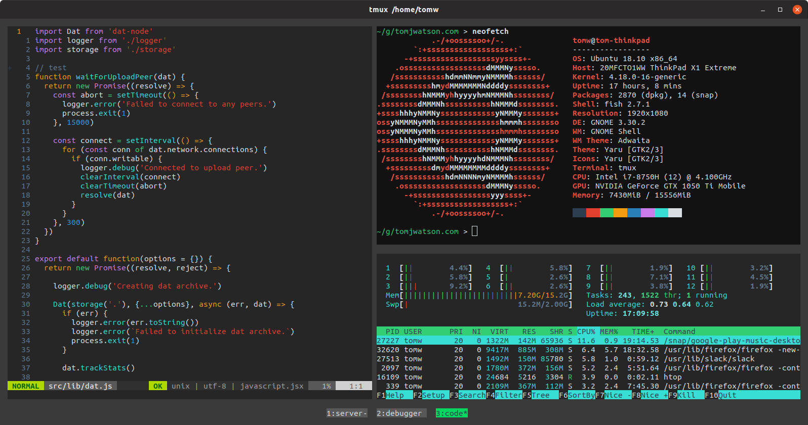

# dotfiles

These dotfiles contain all of the necessary packages, plugins and config I need to be a productive (Python/Javascript/Rust/C) developer. They mostly concern (n)vim, tmux, [Kitty](https://sw.kovidgoyal.net/kitty) and [fish](https://fishshell.com/).



I've tested these dotfiles on both ubuntu and macOS.

## Contents

- custom config for vim/nvim, ack-grep, fish, eslint, tmux and kitty
- vim plugins:
  - [ale](https://github.com/w0rp/ale) - asynchronous code linting
  - [ctrlp.vim](https://github.com/kien/ctrlp.vim) - fuzzy file, buffer, mru, tag, etc finder
  - [nerdtree](https://github.com/scrooloose/nerdtree) - tree-style file explorer
  - [vim-nerdtree-tabs](https://github.com/jistr/vim-nerdtree-tabs) - makes nerdtree work better with tab-based workflow
  - [vim-gitgutter](https://github.com/airblade/vim-gitgutter) - show git diff in the gutter, stage/revert hunks
  - [lightline.vim](https://github.com/itchyny/lightline.vim) - powerful and lightweight status/tabline
  - [maximbaz/lightline-ale](https://github.com/maximbaz/lightline-ale) - ALE indicators for lightline
  - [vim-polyglot](https://github.com/sheerun/vim-polyglot) - improved syntax highlighting
  - [coc.nvim](https://github.com/neoclide/coc.nvim) - LanguageServer client for intelligent autocomplete
- vim colorschemes:
  - [termschool-vim-theme](https://github.com/marcopaganini/termschool-vim-theme)
- TMUX plugins
  - [tpm](https://github.com/tmux-plugins/tpm) - tmux plugin manager
  - [tmux-resurrect](https://github.com/tmux-plugins/tmux-resurrect) - persists tmux environment across system restarts
  - [tmux-yank](https://github.com/tmux-plugins/tmux-yank) - copying to system clipboard

## Requirements

- Ensure you have either neovim or vim >= 8.0. Some plugins such as coc.nvim will need some extra fiddling to get working with regular Vim, though it should be possible. I personally also get much better performance with neovim these days, so that's what I recommend. My fish config aliases `vim` to `nvim`.

These dotfiles are designed to work best with the Kitty terminal emulator, although any other emulator can be used.
- Download and install the latest kitty binaries here - https://sw.kovidgoyal.net/kitty/binary.html. If you want to use a different terminal emulator, configure your terminal background color to `#3a3a3a` for best integration with my vim/tmux config.

- Ensure you have fish installed
```
linux:
sudo apt-get install fish

mac:
brew install fish
echo /usr/local/bin/fish | sudo tee -a /etc/shells
```

- On macOS, set fish as your default shell:
```
chsh -s $(which fish)
```
You will need to logout and log back in for this to take effect.

On linux, weird things happen if you set fish as the default shell, so instead [we have set fish][./.tmux-linux.conf] as the default command for tmux. You can also set fish as the defalt command to run in your terminal emulator, for if you are not using tmux.

- Ensure you have flake8 (for ale python linting) and python-language-server (autocompletion) installed
```
sudo pip install flake8 python-language-server
```

- Ensure you have the python3 neovim interface installed, if you want to use neovim
```
pip3 install neovim
```

- Ensure you have JS/TS language server and eslint requirements installed
```
sudo npm install -g eslint eslint-config-tomjwatson javascript-typescript-stdio typescript-language-server typescript
```

## Installation

- Clone the repository and install the configs
```
git clone https://github.com/tom-james-watson/dotfiles

cd dotfiles

./install.sh
```

- To install the tmux plugins, start tmux and run `prefix` + <kbd>I</kbd>.

- To install the vim plugins, open vim and run
```
:PlugInstall
```

## Updating

- Pull the latest configs from git and install them

```
./update.sh
```

- To update all vim plugins, open vim and run

```
:PlugUpdate
```
